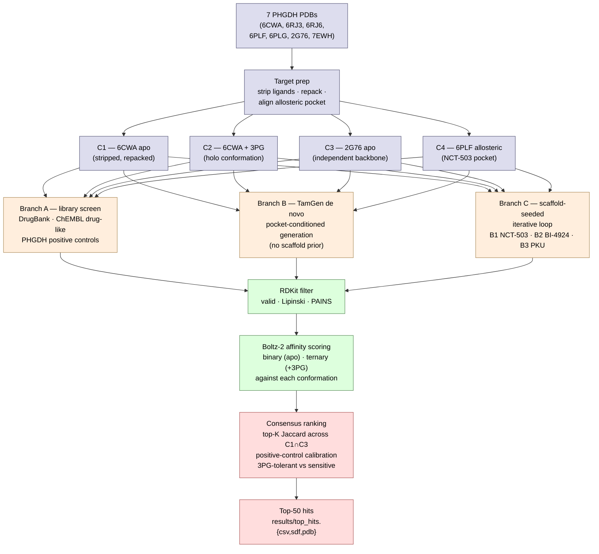
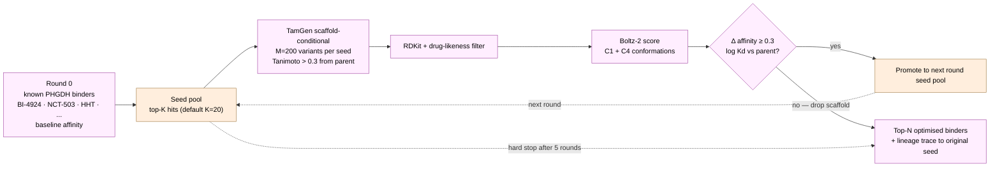

# PHGDH Drug-Discovery Pipeline

In silico drug-discovery pipeline for **PHGDH** (phosphoglycerate dehydrogenase), a moonlighting transcriptional regulator whose NADH-driven DNA-binding activity has recently been implicated in sporadic Alzheimer's disease (Park *et al.*, *Nature* 2025; PubMed 40273909). The pipeline combines **TamGen** (Microsoft target-aware molecule generator) with **Boltz-2** (Wohlwend lab structure + affinity prediction), running natively on **AMD MI300A** GPUs (ROCm).

---

## Pipeline sketch — three parallel branches into one consensus



---

## Iterative scaffold-seeded loop (Branch C, the directed-evolution engine)



---

## Why this design

PHGDH catalyses the first committed step of serine biosynthesis, but recent work shows a **moonlighting transcriptional role**: NADH binding activates direct DNA contact, driving a gene-regulatory program implicated in sporadic Alzheimer's disease. Blocking the NADH-activated form (without disrupting general serine biosynthesis) is the therapeutic axis. NCT-503 — the allosteric PHGDH inhibitor used in the Park *et al.* mouse studies — provides proof-of-concept in vivo.

Two technical choices follow:

- **Ensemble of crystal-state conformations rather than a single PDB.** The literature does not establish whether 3PG induces a meaningful conformational change in PHGDH. Scoring across apo / +3PG / independent-backbone conformations tests the assumption empirically rather than assuming.
- **Iterative scaffold-seeded design rather than pure de novo.** A first pass of pocket-conditioned generation (Branch B) is informative but the gap to medicinal-chem-optimised inhibitors is large. Seeding TamGen with the best known binders and selecting on a Δ-affinity threshold turns the generator into a directed-evolution loop.

See [`PLAN.md`](PLAN.md) for the full plan, strategic decisions, and citations.

---

## Quick start

```bash
# 1. Clone
git clone https://github.com/l1joseph/Alzheimers_Drug_Discovery.git
cd Alzheimers_Drug_Discovery

# 2. Clone the two model tools (gitignored locally)
mkdir -p tools && cd tools
git clone https://github.com/jwohlwend/boltz.git
git clone https://github.com/microsoft/TamGen.git
cd ..

# 3. Build two conda environments
mamba create -n boltz-rocm python=3.11 -c conda-forge
mamba create -n tamgen-rocm python=3.9 -c conda-forge
# Install PyTorch ROCm wheels + boltz package + TamGen deps

# 4. Download TamGen checkpoints (Zenodo: 10.5281/zenodo.13751391)

# 5. Pre-fetch the canonical PHGDH MSA (one-time)
python scripts/fetch_msa.py --fasta data/phgdh_6CWA_chainA.fasta --name phgdh_6CWA_chainA

# 6. Prep target conformations
python scripts/prep_targets.py

# 7. Run pipeline phases (SLURM scripts under slurm/)
sbatch slurm/round0_baseline.sh         # Phase 6 — affinity calibration
sbatch slurm/tamgen_round2_multiseed.sh  # Phase 8 — de novo generation
sbatch slurm/tamgen_b2_scaffold.sh       # Phase 9 — scaffold-seeded
```

---

## Repository layout

```
.
├── PLAN.md                              # full plan (source of truth)
├── README.md                            # this file
├── pocket_center.json                   # substrate cleft / NADH centroid (6CWA frame)
├── pocket_center_allosteric.json        # NCT-503 site center (derived from 6PLF)
├── tamgen_input.csv                     # PDB-id + center for TamGen
├── 6CWA_chainA_clean.pdb / 6CWA.cif     # canonical PHGDH input
├── data/
│   ├── phgdh_6CWA_chainA.fasta          # canonical target sequence (299 aa)
│   ├── libraries/                       # curated compound sets
│   │   ├── known_phgdh_binders.csv      # Round-0 baseline (BI / NCT / HHT series, 10 cpds)
│   │   ├── phgdh_positive_controls.csv  # PDB-bound positive controls
│   │   └── pku_drugs.csv                # optional Branch B3 (pterin scaffolds, 7 cpds)
│   └── pose_recovery_manifest.json
├── scripts/
│   ├── prep_targets.py                  # strip ligands, derive allosteric pocket center
│   ├── build_boltz_yamls.py             # protein + ligand SMILES → Boltz YAML
│   ├── aggregate_boltz.py               # gather Boltz affinity JSON → CSV
│   ├── fetch_msa.py                     # patient ColabFold MMseqs2 poller
│   ├── augment_smiles.py                # RDKit random-traversal augmenter (scaffold-seeded)
│   ├── dedup_smiles.py                  # canonicalise + dedupe SMILES CSV (parent-aware)
│   ├── pose_rmsd.py                     # ligand pose-recovery RMSD vs crystal
│   └── build_pose_recovery_yamls.py
├── slurm/                               # one shell script per phase
│   ├── round0_baseline.sh                       # Phase 6 — known-binder calibration
│   ├── tamgen_round1_score.sh                   # Phase 8 — de novo (single seed)
│   ├── tamgen_round2_multiseed.sh
│   ├── round2_score.sh
│   ├── tamgen_b2_scaffold.sh                    # Phase 9 — scaffold-seeded
│   ├── pose_recovery.sh                         # Phase 2 — crystal-pose validation
│   ├── boltz_screen.sh                          # generic Boltz batch
│   └── *_smoke.sh, msa_local_test.sh            # smoke / validation
└── results/
    ├── round0/baseline_scores.csv               # Phase 6 calibration table
    ├── tamgen_round1/scores.csv
    ├── tamgen_round2/{samples,scores}.csv
    ├── druggability/summary.csv
    └── combined/all_rounds.csv                  # merged leaderboard
```

---

## Notes on running on AMD ROCm

Both models were originally CUDA-targeted; this repo runs them natively on AMD MI300A (gfx942) without source modification:

- **Boltz-2** ships with optional NVIDIA-only kernels (`cuequivariance_torch`). Passing `--no_kernels` falls through to the PyTorch-native implementation that runs unchanged on ROCm.
- **TamGen** depends on PyG companion ops (`torch_cluster`, `torch_scatter`, etc.) that have no ROCm wheels upstream. The CPU wheels (`+pt25cpu`) are ABI-compatible with the ROCm PyTorch build and run the small pocket-encoder graphs at no measurable cost.
- **MSA fetch**: the public ColabFold MMseqs2 server is occasionally slow. Boltz's built-in retry budget gives up at ~30 s, so we pre-fetch each target's MSA once with `scripts/fetch_msa.py` (10-minute polling budget) and reference the cached a3m in subsequent runs.

---

## Key references

- **Park et al. 2025** (Nature, PubMed 40273909) — PHGDH moonlighting DBD → AD
- **Pacold et al. 2016** (Nat Chem Biol) — NCT-503 discovery
- **Spinelli et al. 2021** — BI-4924 series
- **Mullarky et al. 2016** — CBR-5884 covalent inhibitor
- **Wohlwend et al. 2024** — Boltz / Boltz-2
- **Tu et al. 2024** (Brief Bioinform, PubMed 39472567) — TamGen
