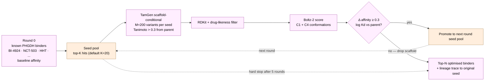

# PHGDH Drug-Discovery Pipeline

In silico drug-discovery pipeline for **PHGDH** (phosphoglycerate dehydrogenase), a moonlighting transcriptional regulator whose NADH-driven DNA-binding activity has recently been implicated in sporadic Alzheimer's disease (Park *et al.*, *Nature* 2025; PubMed 40273909). The pipeline combines **TamGen** (Microsoft target-aware molecule generator) with **Boltz-2** (Wohlwend lab structure + affinity prediction) on the **SDSC Cosmos** cluster's AMD MI300A GPUs (ROCm 6.3 / gfx942).

> See [`PLAN.md`](PLAN.md) for the full plan, biology background, strategic decisions, and citations.

---

## Pipeline sketch — three parallel branches into one consensus


---

## Iterative scaffold-seeded loop (Branch C, the directed-evolution engine)



---

## Status (commit `a771486`)

✅ Phase 0 — env setup (Boltz + TamGen on ROCm 6.3, both validated end-to-end on MI300A)
✅ Phase 1 — smoke tests (real inference output, ~9 s/lig effective on 4 APUs)
✅ Phase 4 — druggability (FPocket on 4 conformations; holo-stripped → repack-required finding)
✅ Phase 5 — library staging (10 known binders + 7 PKU drugs curated)
✅ Phase 6 — **Round-0 baseline calibration**: top picks ONS (NCT-cmpd-15), K5K (BI-4924), ONV (NCT-cmpd-1); bottom 3PG and NCT-503-parent. Confirms Boltz-2 ranks medicinal-chem analogues correctly.
✅ Phase 8 — TamGen de novo rounds 1 + 2 (90 candidates scored, best at aff = −0.27)
🏃 Phase 9 — Branch B2 scaffold-seeded (queued, BI-4924 family)
⏳ Phase 2 — pose-recovery (deferred until ColabFold MSA server is less flaky — see `scripts/fetch_msa.py` for the patient-poll workaround)
⏳ Phase 7 — DrugBank/ChEMBL library screen

---

## Quick start

```bash
# 1. Clone (you already are if you're reading this)
git clone git@github.com:l1joseph/Alzheimers_Drug_Discovery.git
cd Alzheimers_Drug_Discovery

# 2. Clone Boltz + TamGen into tools/ (.gitignored)
mkdir -p tools && cd tools
git clone https://github.com/jwohlwend/boltz.git
git clone https://github.com/microsoft/TamGen.git
cd ..

# 3. Build the two conda envs (Cosmos / ROCm 6.3)
# See PLAN.md § Installation for the patches (Boltz drops [cuda]; TamGen uses CPU PyG wheels)

# 4. Download TamGen checkpoints from Zenodo to scratch + symlink
# See PLAN.md § Installation

# 5. Fetch canonical PHGDH MSA once (Boltz's built-in retry budget is too tight)
python scripts/fetch_msa.py --fasta data/phgdh_6CWA_chainA.fasta --name phgdh_6CWA_chainA

# 6. Prep target conformations
python scripts/prep_targets.py

# 7. Submit phases as SLURM jobs
sbatch slurm/round0_baseline.sh     # Phase 6 — calibration
sbatch slurm/tamgen_round2_multiseed.sh   # Phase 8 — de novo
sbatch slurm/tamgen_b2_scaffold.sh   # Phase 9 — BI-4924 scaffold
```

---

## Repository layout

```
.
├── PLAN.md                              # full plan (this is the source of truth)
├── README.md                            # this file
├── pocket_center.json                   # substrate cleft / NADH centroid (6CWA frame)
├── pocket_center_allosteric.json        # NCT-503 site center (derived from 6PLF)
├── tamgen_input.csv                     # PDB-id + center for TamGen
├── 6CWA_chainA_clean.pdb / 6CWA.cif     # canonical PHGDH input
├── data/
│   ├── phgdh_6CWA_chainA.fasta          # canonical target sequence (299 aa)
│   ├── libraries/
│   │   ├── known_phgdh_binders.csv      # Round-0 baseline set (10 cpds, BI / NCT / HHT series)
│   │   ├── phgdh_positive_controls.csv  # PDB-bound positive controls
│   │   └── pku_drugs.csv                # optional Branch B3 (pterin scaffolds, 7 cpds)
│   ├── pose_recovery_manifest.json      # crystal-bound pose-recovery cases
│   ├── structures/    [gitignored]      # raw CIFs (regen from RCSB)
│   ├── targets/       [gitignored]      # prepped per-conformation PDBs (regen from prep_targets.py)
│   ├── msa/           [gitignored]      # cached a3m MSA per protein (regen via fetch_msa.py)
│   └── *_yamls/       [gitignored]      # per-run Boltz YAMLs (regenerable)
├── scripts/
│   ├── prep_targets.py                  # strip ligands, derive allosteric pocket center
│   ├── build_boltz_yamls.py             # protein + ligand SMILES → Boltz YAML
│   ├── aggregate_boltz.py               # gather Boltz affinity/confidence JSON → CSV
│   ├── fetch_msa.py                     # patient ColabFold MMseqs2 poller (Boltz's retry is too tight)
│   ├── augment_smiles.py                # RDKit random-traversal augmenter (scaffold-seeded)
│   ├── dedup_smiles.py                  # canonicalise + dedupe SMILES CSV (parent-aware)
│   ├── pose_rmsd.py                     # ligand pose-recovery RMSD vs crystal
│   └── build_pose_recovery_yamls.py
├── slurm/
│   ├── boltz_smoke.sh, tamgen_smoke.sh, tamgen_real_smoke.sh   # smoke tests
│   ├── round0_baseline.sh                                       # Phase 6
│   ├── tamgen_round1_score.sh, tamgen_round2_multiseed.sh,
│   │   round2_score.sh                                          # Phase 8 de novo
│   ├── tamgen_b2_scaffold.sh                                    # Phase 9 BI-4924 scaffold-seeded
│   ├── pose_recovery.sh, msa_local_test.sh, check_scratch.sh    # validation
│   └── boltz_screen.sh                                          # generic Boltz batch
├── logs/      [gitignored except .gitkeep]                      # SLURM logs with chrono symlinks
├── results/
│   ├── smoke/, druggability/                                    # FPocket + smoke outputs
│   ├── round0/baseline_scores.csv                               # Phase 6 calibration table
│   ├── tamgen_round1/scores.csv, tamgen_round2/{samples,scores}.csv
│   └── combined/all_rounds.csv                                  # merged leaderboard
├── tools/     [gitignored]                                      # Boltz + TamGen submodules (clone manually)
└── docs/figures/                                                # diagrams
```

---

## Compute notes (Cosmos / ROCm)

- **Scratch**: `/cosmos/vast/scratch/$USER` (Vast Data, 675 TB). NOT `/ddn_scratch` — that path doesn't exist on Cosmos despite the `$SCRATCH` env var pointing there.
- **Boltz on ROCm**: must pass `--no_kernels` to skip the NVIDIA-only `cuequivariance_torch` kernel and fall through to PyTorch SDPA.
- **TamGen on ROCm**: PyG companion ops (`torch_cluster` etc.) have no ROCm wheels; we use CPU wheels (`+pt25cpu`), ABI-compatible with the ROCm PyTorch.
- **MSA**: public ColabFold server is slow; Boltz's built-in retry gives up at ~30 s. `scripts/fetch_msa.py` patient-polls (10 min budget) and caches per-protein a3m to `data/msa/`.
- **Throughput**: ~25 s per protein-ligand pair on 1 MI300A APU (structure + affinity). DDP across 4 APUs needs a spawn-not-fork tweak (deferred).
- **SLURM log discipline**: every job sets `--job-name`, absolute `--output`/`--error` under `logs/`, plus a chronological symlink (`YYYYMMDD-HHMMSS_<name>_<jobid>.out`).

---

## Key references

- **Park et al. 2025** (Nature, PubMed 40273909) — PHGDH moonlighting DBD → AD
- **Pacold et al. 2016** (Nat Chem Biol) — NCT-503 discovery
- **Spinelli et al. 2021** — BI-4924 series
- **Mullarky et al. 2016** — CBR-5884 covalent inhibitor
- **Wohlwend et al. 2024** — Boltz / Boltz-2
- **Tu et al. 2024** (Brief Bioinform, PubMed 39472567) — TamGen
