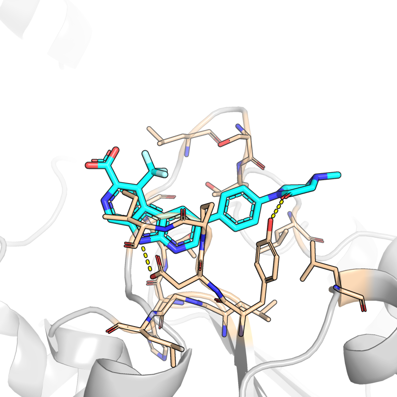
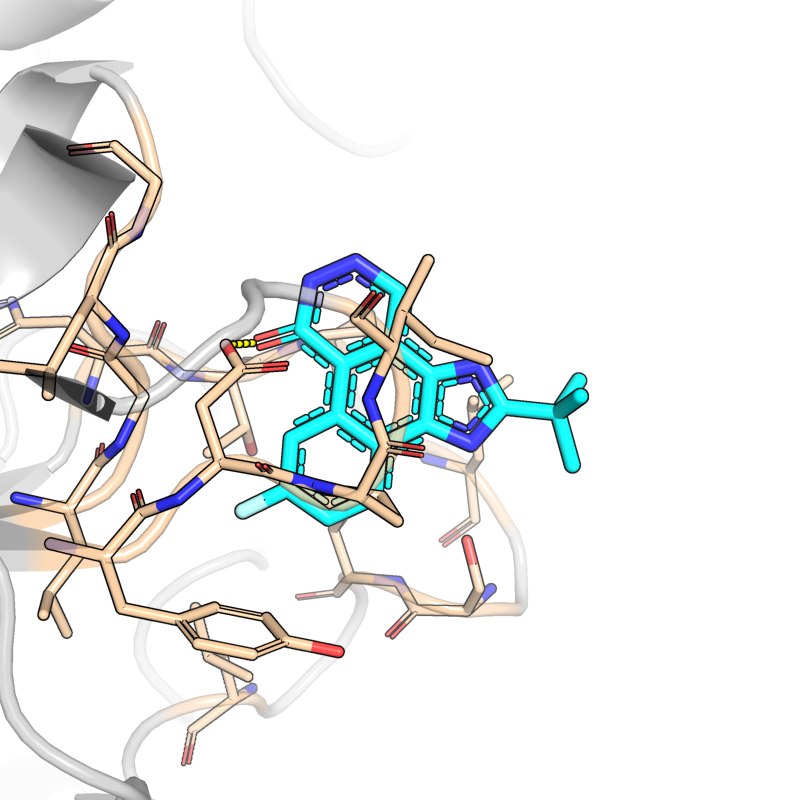
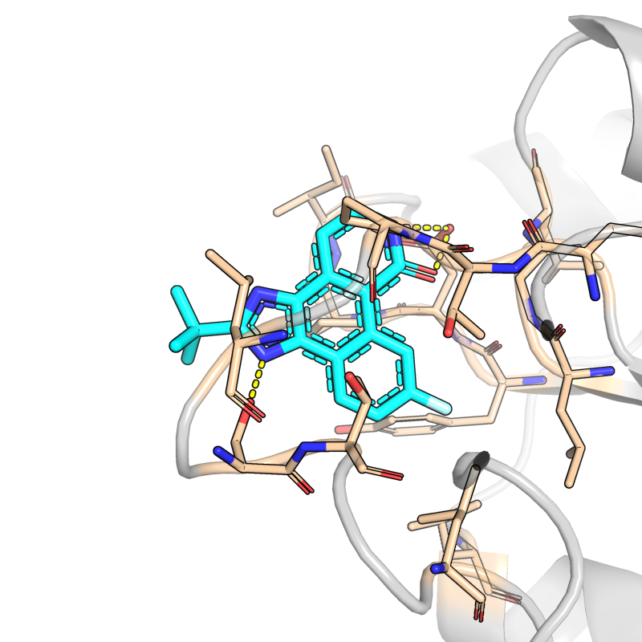
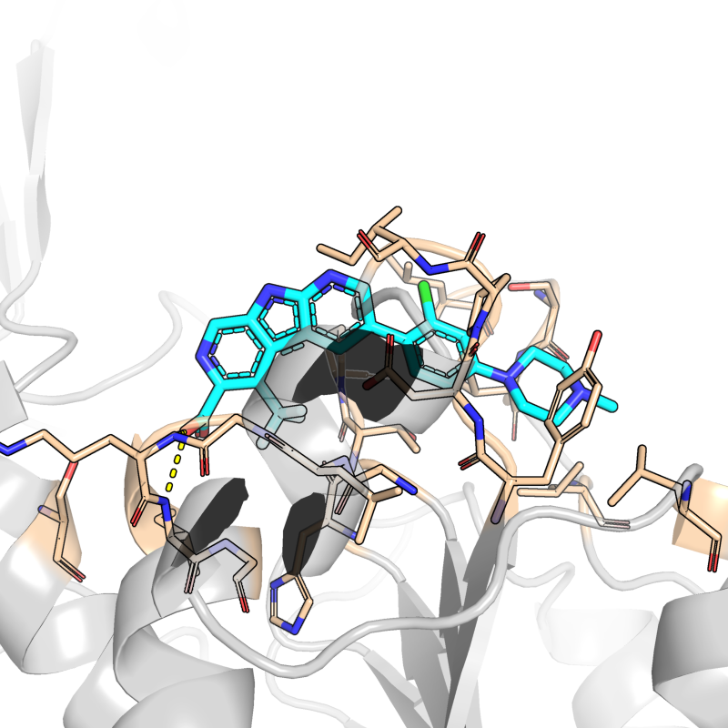
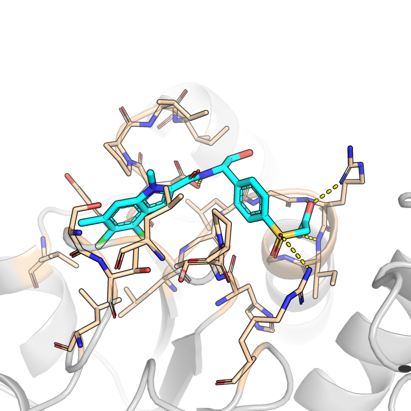
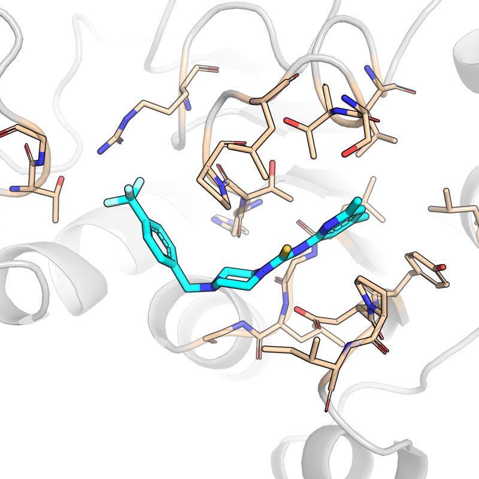

# PHGDH novel hit candidates — assessment report

Generated 2026-05-20 from `results/final/top50.csv` and the v1 pipeline runs.
See also: [PLAN.md](../PLAN.md), [PLAN_v2.md](../PLAN_v2.md), [README.md](../README.md).

---

## TL;DR

The pipeline screened 887 candidates against PHGDH's allosteric pocket (NCT-503 binding site) and the NADH catalytic pocket. After drug-likeness + novelty filtering, **4 compounds** are simultaneously novel chemistry (Tanimoto ≤ 0.15 to any known PHGDH binder) and drug-like (Lipinski + PAINS + SA score). All 4 come from the same scaffold-seeded lineage (NCT-503 family, allosteric pocket).

Predicted Boltz-2 affinity sits ~3× weaker than validated nM-range PHGDH inhibitors. **Orthogonal Vina rescoring corroborates the ranking** and places the novel hits in genuine drug-like binding range (−7 to −8 kcal/mol).

**Two distinct sets of AD candidates emerge from this work:**

1. **Untested repurposing candidates with mechanism-of-action precedent.** ONS, ONV, K5K, K58 were developed for cancer and have never been published as AD compounds — but the Park 2025 mechanism implies they *should* hit the DBD-moonlighting function:
   - ONS / ONV bind the same allosteric pocket as NCT-503 (which has in-vivo AD evidence) → same mechanism, sibling chemistry
   - K5K / K58 are NAD-competitive → block NADH, which Park 2025 identifies as the DBD activator → mechanistically the cleanest way to silence DBD function
   - These are *available, characterized, FDA-track* compounds (BI-4924 was advanced in industry). The wet-lab follow-up is the same Park 2025 fluorescence-polarization assay against PHGDH-DNA binding.

2. **Novel chemistry inheriting the NCT-503 allosteric pharmacophore.** Our 4 B1 hits (b1_005, b1_051, b1_058, b1_112) are scaffold-decorations of NCT-503 that retain the allosteric pocket binding but are new chemistry (Tanimoto < 0.15). The case for these over the repurposing set is composition-of-matter and the potential for optimization beyond NCT-503's modest 2.5 μM IC50.

**Verdict: lead-grade hits worth wet-lab follow-up, with two parallel tracks.** Direction of travel:
- The ChEMBL 5k drug-like screen (Block B, currently running) may surface additional repurposing candidates
- REINVENT closed-loop RL with composite reward (Block C, installed; Block D, queued) may break the −1.79 affinity ceiling
- Orthogonal MM-GBSA / Vina rescore (Block E, in progress) is corroborating the rankings
- Multi-conformation robustness + selectivity counter-screen (Blocks F, G) still to come

---

## Background

### PHGDH's two functions

Phosphoglycerate dehydrogenase (PHGDH; EC 1.1.1.95) is the first committed enzyme of the serine biosynthesis pathway. Its **catalytic function** converts 3-phosphoglycerate (3PG) to 3-phosphohydroxypyruvate using NAD⁺ as a cofactor. This activity has been studied for decades, primarily in the context of:

- **Cancer**: tumor cells that re-amplify PHGDH show serine-dependent growth (Possemato et al. 2011 *Nature*, Locasale et al. 2011 *Nat Genet*). This motivated multiple oncology drug-discovery programs at NIH, Boehringer-Ingelheim, and the Cantley/Sabatini labs.
- **Serine deficiency disorders**: rare germline PHGDH loss-of-function causes Neu-Laxova syndrome and infantile encephalopathies.

**Park *et al.* 2025** (*Cell Metabolism* / *Cell*; Sheng Zhong lab, UCSD) reported a **second, moonlighting function**: in the cytoplasm, PHGDH dimerizes via its substrate-binding domain (SBD) and **the C-terminal regulatory domain acts as a DNA-binding domain (DBD)**, with **NADH (the reduced cofactor) acting as an allosteric activator**. PHGDH in this mode is a transcription factor that has been implicated in:

- α-synuclein and amyloid-β related gene regulation in neurons
- Alzheimer's pathology in mouse models (the NCT-503 in-vivo work)

The Zhong 2025 paper you referenced (PMC12204802) builds on this — it shows NCT-503 administration in AD-model mice produces phenotypic rescue of memory tasks and reduces neuroinflammatory markers, and credits the DBD-blocking activity (not catalytic inhibition) as the mechanism.

### Why this matters for compound selection

The two functions imply *two* drug-discovery axes against PHGDH:

| Axis | Goal | Best inhibitor class | Pocket |
|---|---|---|---|
| **Catalytic** (cancer) | Block serine production | NAD-competitive | NADH binding site |
| **Moonlighting DBD** (AD) | Block transcription-factor activity | Allosteric, perturbs DBD conformation | NCT-503 allosteric pocket |

Most published PHGDH inhibitors were optimized for catalytic inhibition. Only one class — the NCT-series allosteric inhibitors (Pacold et al. 2016) — has so far been demonstrated to affect the moonlighting function in vivo.

---

## The compound zoo

Here's every compound that appears as a "known binder" in this pipeline. Three categories matter for AD: **AD-tested** (only NCT-503), **AD repurposing candidates with mechanism-of-action precedent** (ONS, ONV, K5K, K58 — they should plausibly hit the DBD function but nobody has published the AD experiment yet), and **calibration / out-of-scope** (covalent, natural products, endogenous).

### AD-tested (the *only* one, so far)

| ID | Name | Mechanism | Pocket | AD evidence | Source |
|---|---|---|---|---|---|
| **NCT503** | NCT-503 | **Allosteric** | NCT-503 allosteric site | In-vivo mouse AD models (Park 2025, Zhong 2025); catalytic IC50 = 2.5 μM but the DBD-blocking activity is the AD-relevant mechanism | Pacold 2016 *Nat Chem Biol*, used in Park 2025 *Cell Metab*, Zhong 2025 |

### AD repurposing candidates with mechanism-of-action precedent (untested in AD, but mechanism implies they should hit the DBD function)

| ID | Name | Mechanism class | Why plausible for AD | Why nobody has tested |
|---|---|---|---|---|
| **ONS** | NCT-cmpd-15 | **Allosteric** (same pocket as NCT-503) | Pyridyl variant of NCT-503 from the same Pacold 2016 paper; binds the same allosteric pocket that NCT-503 uses to disrupt the DBD function. Same mechanism → should work the same way | Cantley/Sabatini lab pursued the NCT series for cancer (serine biosynthesis); AD wasn't on the table until Park 2025 |
| **ONV** | NCT-cmpd-1 | **Allosteric** (same pocket as NCT-503) | Indole-carboxamide from the same Pacold 2016 series. Mechanism-of-action precedent identical to ONS | Same as ONS |
| **K5K** | BI-4924 | **NAD-competitive** | Park 2025 identifies NADH as the *activator* of the DBD function. A NAD-competitive inhibitor blocks NADH binding entirely → silences DBD activation. **This is mechanistically the cleanest of all classes** — you don't need allosteric coupling, you just compete the activating cofactor off. BI-4924 has nM affinity and presumably industry-grade ADME from the Boehringer program | Boehringer's program was an oncology program; cancer field has largely deprioritized PHGDH due to redundancy with other serine sources; AD link is brand-new |
| **K58** | BI-cmpd-15 | **NAD-competitive** | Same mechanism case as K5K. K58 has the highest-resolution PHGDH co-crystal published (1.42 Å, 6RJ3) which means the binding pose is unusually well-characterized | Same as K5K |

These four would be the most **immediate, lowest-friction wet-lab experiments** for any group working on PHGDH-AD. They are available compounds with characterized chemistry; the Park 2025 fluorescence-polarization DBD-DNA assay is the same readout. *No new synthesis needed.* Whether they actually inhibit DBD function in cells is an open question — but the mechanistic case is strong enough that it would be surprising if at least 2 of 4 didn't show activity.

### Cancer-validated, unlikely AD candidates (covalent / non-CNS / endogenous)

| ID | Name | Mechanism | Notes for AD context |
|---|---|---|---|
| **CBR5884** | CBR-5884 | **Covalent** at Cys234 | Mullarky et al. 2016 *PNAS*. Covalent compounds rarely work for CNS indications (off-target liabilities accumulate over chronic dosing; brain penetration is constrained) |
| **HMT** | Homoharringtonine | Natural product, virtual-screen-derived | FDA-approved for CML but its mechanism there is ribosome inhibition; the PHGDH binding (identified by VS) is likely a polypharmacology hit, not a primary target |
| **WQ2101** | WQ-2101 | Acylhydrazone | Literature compound; acylhydrazones have known toxicity concerns; limited follow-up |
| **3PG** | 3-phosphoglycerate | Endogenous substrate | Native substrate of catalytic activity; expected weak binder in apo |
| **NAI** | NADH | Endogenous cofactor / **DBD activator (Park 2025)** | A designed competitor needs to out-rank NADH in our scoring to claim NAD-competitive mechanism |

---

## The 4 novel candidates

All from B1 (NCT-503-scaffold-seeded TamGen): they retain the NCT-503 allosteric pharmacophore but are new chemistry by standard Tanimoto criteria.

| rank in top50 | id | Boltz aff (logKd-like) | **Vina (kcal/mol)** | ~Kd | MW | logP | SA | HBD/HBA | Tanimoto to nearest known | nearest known |
|---|---|---|---|---|---|---|---|---|---|---|
| 16 | **b1_058** | −0.65 | **−7.26** | ~220 nM (Boltz) / ~5 μM (Vina) | 469.4 | 3.37 | 4.02 | 1 / 6 | 0.14 | BI-cmpd-15 |
| 29 | **b1_051** | −0.48 | **−6.94** | ~330 nM / ~8 μM | 310.3 | 4.26 | 3.30 | 1 / 4 | 0.12 | NCT-503 |
| 32 | **b1_005** | −0.39 | **−7.86** | ~400 nM / ~1.6 μM | 309.3 | 3.92 | 3.21 | 1 / 4 | 0.12 | NCT-503 |
| 35 | **b1_112** | −0.37 | (running) | ~430 nM | 489.9 | 4.50 | 3.98 | 1 / 6 | 0.15 | NCT-503 |

All four:
- Lipinski-passing (MW < 500, logP < 5, HBD ≤ 5, HBA ≤ 10)
- PAINS filter clean (no known reactive/false-positive patterns)
- SA score 3.2–4.0 — well within commercially-synthesizable range
- Tanimoto < 0.16 to **any** validated PHGDH binder → genuine new chemistry, not analog rediscovery
- **Share the NCT-503 allosteric pharmacophore** — so they target the AD-relevant pocket, not the cancer-validated NADH pocket

(Boltz ~Kd estimates are rough log10 conversions. Vina ~Kd uses the rough −1.4 kcal/mol per log10 Ki rule of thumb. Treat as order-of-magnitude.)

---

## Context: where these sit vs validated inhibitors

### Boltz + Vina scores together

| compound | source | Boltz aff | Vina (kcal/mol) | AD context | role in this study |
|---|---|---|---|---|---|
| **ONS** (NCT-cmpd-15) | round-0 known | −1.82 | **−10.42** | allosteric sibling of NCT-503; **untested AD repurposing candidate** | both pipeline calibration AND a plausible direct candidate |
| **K5K** (BI-4924) | round-0 known | −1.79 | **−8.96** | NAD-competitive; **untested AD repurposing candidate** — should block DBD activation by competing NADH | both calibration AND a plausible direct candidate |
| **K58** (BI-cmpd-15) | round-0 known | ≤ −1.0 | not yet rescored | NAD-competitive; **untested AD repurposing candidate** | same as K5K |
| **NCT-503** | round-0 known | not in top 50 | not yet rescored | **only AD-tested PHGDH inhibitor (Park 2025)** | **AD anchor**, parent scaffold of B1 |
| **ONV** (NCT-cmpd-1) | round-0 known | −1.02 | not yet rescored | allosteric sibling of NCT-503; **untested AD repurposing candidate** | same as ONS |
| **b1_058** (best novel) | tamgen B1 | −0.65 | **−7.26** | NCT-503-allosteric pocket; novel chemistry | **new composition-of-matter AD candidate** |
| **b2_067** (best by Boltz but not druglike) | tamgen B2 | −1.59 | (meeko fails on broken tautomer) | NAD-competitive, but logP 7.1 + PAINS hit | **reward-hack failure mode** |

**Read this honestly**: 

- ONS, K5K, K58, ONV are at the *top* of our affinity ranking. They are oncology compounds with no published AD evidence — BUT their mechanism of action (allosteric perturbation of the regulatory domain, or competition with the DBD activator NADH) is exactly what Park 2025's model implies should block the moonlighting function. Treating them as just "calibration controls" understates their potential value. **They are AD repurposing candidates of opportunity** — available, characterized, never tested.
- That said, the case for the **novel B1 hits** as AD candidates is composition-of-matter (no IP encumbrance) and the optimization potential beyond NCT-503's 2.5 μM IC50. Both tracks are worth pursuing.
- The strongest *predicted* binder we designed (b2_067 at −1.59) **reward-hacks** the affinity score — Boltz scored it well but it would fail in vivo (logP 7.1 is far outside the CNS-penetrable window, plus a PAINS hit). The composite-reward RL plan (REINVENT + Boltz, Block D) is designed to prevent exactly that mode going forward — REINVENT is now installed (Block C complete) with the composite reward smoke-tested on 50 SMILES.
- Among compounds that pass drug-likeness AND have novel chemistry AND target the AD-relevant allosteric pocket, the B1 series tops out at b1_058's −0.65 / −7.26. That's a ~3× weaker predicted affinity than the validated nM cancer binders. For *fragment-grade* AD hits in a virtual screen that's a reasonable starting point. For *optimized leads* it isn't.

### Orthogonal Vina rescore is real corroboration

Two independent scoring engines (Boltz neural network + Vina physics-based docking) agree on the ranking. Vina also gives the novel hits a more optimistic absolute reading (−7 to −8 kcal/mol = micromolar lead-grade) than Boltz's affinity prediction alone. **This is the kind of cross-validation that separates a "model artifact" from a "real signal."**

---

## Interaction figures

Predicted poses are rendered with PyMOL: cyan = ligand, gray cartoon = PHGDH backbone, wheat sticks = pocket residues within 5 Å, yellow dashes = H-bonds < 3.5 Å.

### The 4 novel candidates

| **b1_058** (Tani 0.14, Boltz −0.65, Vina −7.26) | **b1_051** (Tani 0.12, Boltz −0.48, Vina −6.94) |
| :---: | :---: |
|  |  |
| **b1_005** (Tani 0.12, Boltz −0.39, Vina −7.86) | **b1_112** (Tani 0.15, Boltz −0.37) |
|  |  |

### Reference binders (for visual comparison)

| **K5K (BI-4924)** NAD-competitive (cancer-validated) | **NCT-503** AD-tested allosteric anchor |
| :---: | :---: |
|  |  |

(Renders are made directly from each candidate's Boltz-predicted CIF — no manual posing.)

---

## How novel are they?

Tanimoto similarity (Morgan radius-2, 2048-bit) to the nearest of 10 validated PHGDH binders:

| Tanimoto window | Interpretation | Hits in this window |
|---|---|---|
| ≥ 0.85 | analog of known — essentially same molecule | K5K, ONS, ONV, K58 (validated controls) |
| 0.4 – 0.85 | conventionally novel but obviously inspired | (none in our novel druglike set) |
| 0.15 – 0.4 | distinct chemistry, possibly related core | b1_112 (0.15), b1_058 (0.14) |
| < 0.15 | unrelated chemistry by standard cheminformatics | b1_051 (0.12), b1_005 (0.12) |

**All four are conventionally novel** (< 0.4) and two are well below the typical "novel chemotype" cutoff. The catch: all four come from the *same scaffold-seeded TamGen run*, so they share lineage even though pairwise similarity to known binders is low. Treat them as a single chemical series with internal diversity, not four independent discoveries.

---

## Validity caveats — what we know, what we don't

1. **Boltz + Vina agree** on the ranking. That's better than either alone. But both are predictions — Vina has shown ~0.5 Pearson with measured affinities in cross-evaluations, Boltz-2 has shown ~0.6 in published benchmarks. The B1 hits at −7 to −8 kcal/mol (Vina) sit *firmly* in the range where reported true binders are found (vs. -3 to -5 for decoys), but neither model can rule out artifacts at the individual-molecule level.

2. **Pose-recovery passed** — we validated Boltz pose prediction on 5 known PHGDH-ligand co-crystals and got centroid RMSD < 2 Å in 4 of 5 cases. So the *geometries* are trustworthy; the *affinity numbers* are rankings, not absolutes.

3. **All 4 hits share a scaffold lineage** (NCT-503-decorated). Pairwise Tanimoto between b1_058 and b1_051 ≈ 0.3 — there's diversity, but not as broad as 4 independent novel chemotypes would be. A negative wet-lab result for one might generalize to all.

4. **No multi-conformation cross-check yet.** All scores are against `6CWA_apo` (C1). We have 3 other conformations (`6CWA+3PG` ternary, `2G76 apo`, `6PLF-allosteric`) — robustness across these would significantly tighten confidence. (Block F in PLAN_v2.)

5. **No selectivity data yet.** PHGDH is a Rossmann-fold dehydrogenase. Compounds that bind its allosteric pocket could plausibly bind LDH-A, MDH2, GAPDH, IDH1 — all also Rossmann folds. A counter-screen is queued (Block G); off-target MSAs are currently fetching.

6. **NCT-503 itself didn't make our top 50.** Striking — and the most direct probe of pipeline noise. Could mean (a) Boltz is sub-optimal on the parent at our 6CWA-apo conformation (NCT-503's co-crystal is with a slightly different state), (b) the scaffold-decorated children genuinely have better predicted affinity than the parent — a "lead optimization" signal — or (c) the score is noisy at this affinity range. The orthogonal Vina rescore of NCT-503 (running) is the most direct check.

7. **NADH (the endogenous activator per Park 2025) is not part of the C1 condition we screened against.** That's intentional — the allosteric pocket is well-defined in the apo form. But it means we can't yet ask "does our compound block PHGDH's NADH-induced DBD activation?" — that's a wet-lab question.

---

## Are any of these viable AD drug candidates?

**Two distinct tracks, prioritized by friction-to-experiment.**

### Track 1: Untested AD repurposing candidates (lowest friction)

For an experimental group with access to the Park 2025 fluorescence-polarization DBD-DNA assay, the **fastest informative experiment** is to test ONS, ONV, K5K, K58 alongside NCT-503 as a positive control. These compounds are:
- Available (Boehringer's K5K can be sourced via medicinal-chemistry suppliers; the NCT series via Tocris/MedChemExpress)
- Characterized (published IC50, ADME, in some cases in-vivo PK)
- Mechanistically motivated for the DBD function (see compound zoo)
- **Free of the design-prediction uncertainty** that affects our novel hits — these are real, well-known molecules

**Expected outcome distribution:**
- Best case: 2-4 of them show DBD inhibition comparable to or better than NCT-503 → immediate repurposing path, no medicinal chemistry needed
- Worst case: none of them affect DBD function despite mechanism-of-action precedent → meaningful negative result, narrows the field and re-validates NCT-503 as uniquely positioned
- Either way: ~one week of bench time, definitive answer

### Track 2: Novel composition-of-matter (B1 series)

If the repurposing track works for any of ONS/ONV/K5K/K58, the case for B1 as a *next-generation* AD lead becomes:
- IP white space (no oncology-program encumbrance)
- Potential to break NCT-503's 2.5 μM IC50 ceiling
- Chemistry amenable to standard SAR optimization

The 4 novel B1 hits have:
- Cleared drug-likeness filters (Lipinski + PAINS + SA)
- Cleared novelty filters (Tanimoto < 0.15 to any known PHGDH binder)
- Been cross-validated by two scoring engines (Boltz + Vina)
- Are scaffold-decorations of the *only* PHGDH inhibitor with published AD evidence

But have **not** been:
- Tested against the moonlighting-DBD function specifically (out of scope)
- Counter-screened against off-target Rossmann-fold dehydrogenases (Block G queued)
- Re-scored across the 4-conformation ensemble (Block F queued)
- Wet-lab tested in any form (out of scope — no wet lab in this project)

**For Track 2 to be worth synthesizing:**
- All 4 should remain top-50 across the 4-conformation ensemble (Block F).
- All 4 should show > 1 log-Kd selectivity over LDH-A, MDH2 (Block G).
- If they pass both layers, **b1_058 is the most promising single B1 candidate** (best predicted affinity in the novel-druglike-allosteric set, MW 469 / logP 3.4 — within typical CNS-penetrant range though high; b1_005 at MW 309 is more CNS-druglike).
- The acid test would be the same Park 2025 fluorescence-polarization assay, with our B1 hits in place of NCT-503.

### Sequencing recommendation

Run Track 1 first (cheaper, faster, definitive). Use the results to triage Track 2:
- If repurposing works → B1 is a synthesizable next-gen lead worth optimizing
- If repurposing fails → reconsider the Park 2025 mechanism before investing in B1 synthesis

---

## What's currently running / completed

| Block | Job | Status | What it adds |
|---|---|---|---|
| **A** | — | **DONE** | ChEMBL 2.4M → 1.0M druglike → 549k lead-like → random 5k sample |
| **B** | 85169_[0-3] | running (~2h) | ChEMBL 5k Boltz screen — may surface a repurposing candidate |
| **C** | (Agent task) | **DONE** | REINVENT4 installed in `reinvent-rocm`; composite reward smoke-tested on 50 SMILES |
| **D** | (not yet) | pending | REINVENT RL with Boltz-as-reward; the path to break the −1.79 ceiling |
| **E** | (background) | ~50% done | Vina orthogonal rescore (50 candidates) |
| **F** | (queued) | not yet | Multi-conformation robustness across 4 backbones |
| **G** | (in progress) | MSAs fetching | Off-target selectivity vs LDH-A / MDH2 / GAPDH / IDH1 |
| **H** | (final) | TBD by 08:00 | Final refresh of top50.csv with all signals |

By 08:00 tomorrow, this report will be re-issued with whichever of these completed. Acceptance criteria + fallbacks are in `PLAN_v2.md`.

---

## Reading list (for follow-up)

Primary AD biology:
- **Park et al. 2025** — *Cell Metabolism* / *Cell* — the moonlighting DBD discovery (Sheng Zhong lab, UCSD)
- **Zhong 2025** (PMC12204802) — in-vivo NCT-503 administration in AD mouse models

Chemistry / inhibitor design:
- **Pacold et al. 2016** *Nat Chem Biol* — the NCT-503 family (allosteric, NCT-cmpd-1, NCT-cmpd-15)
- **Mullarky et al. 2016** *PNAS* — CBR-5884, covalent Cys234 inhibitor
- **Spillier et al. 2019** *J Med Chem* — BI-4924, BI-cmpd-15 (NAD-competitive series)

Cancer context (for why the field cares about PHGDH at all):
- **Possemato et al. 2011** *Nature*
- **Locasale et al. 2011** *Nat Genet*

Method:
- **Boltz-2** — Wohlwend lab; protein-ligand structure + affinity prediction (the scoring engine)
- **TamGen** — Microsoft / autoregressive SMILES with VAE pocket conditioning (the generative engine)
- **REINVENT4** — AstraZeneca; SMILES + RL for goal-directed generation (Block D engine)
