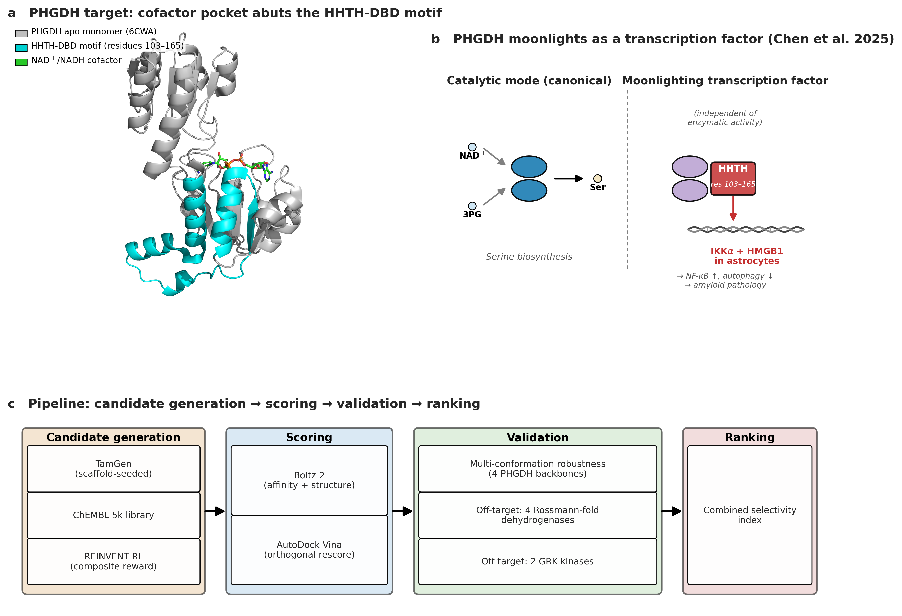
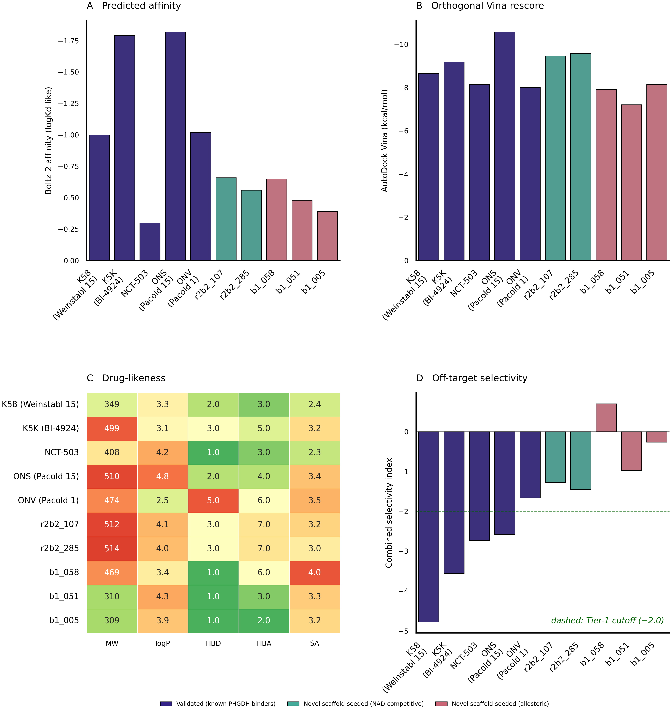
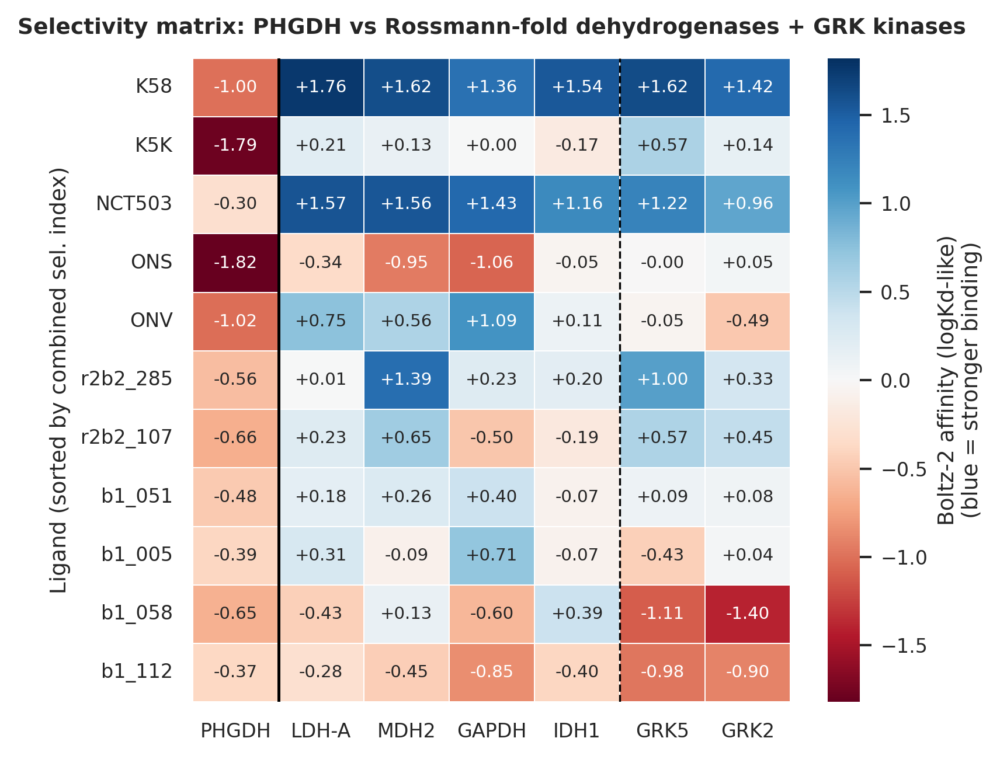
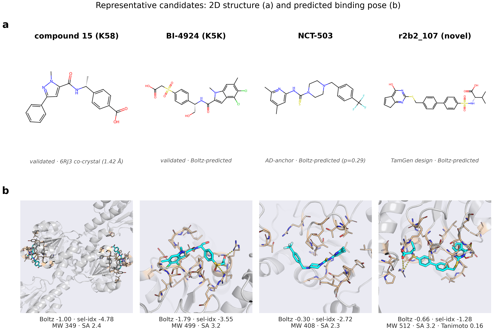
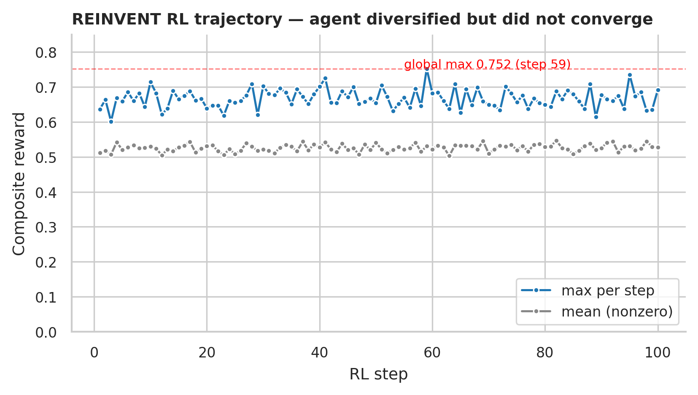
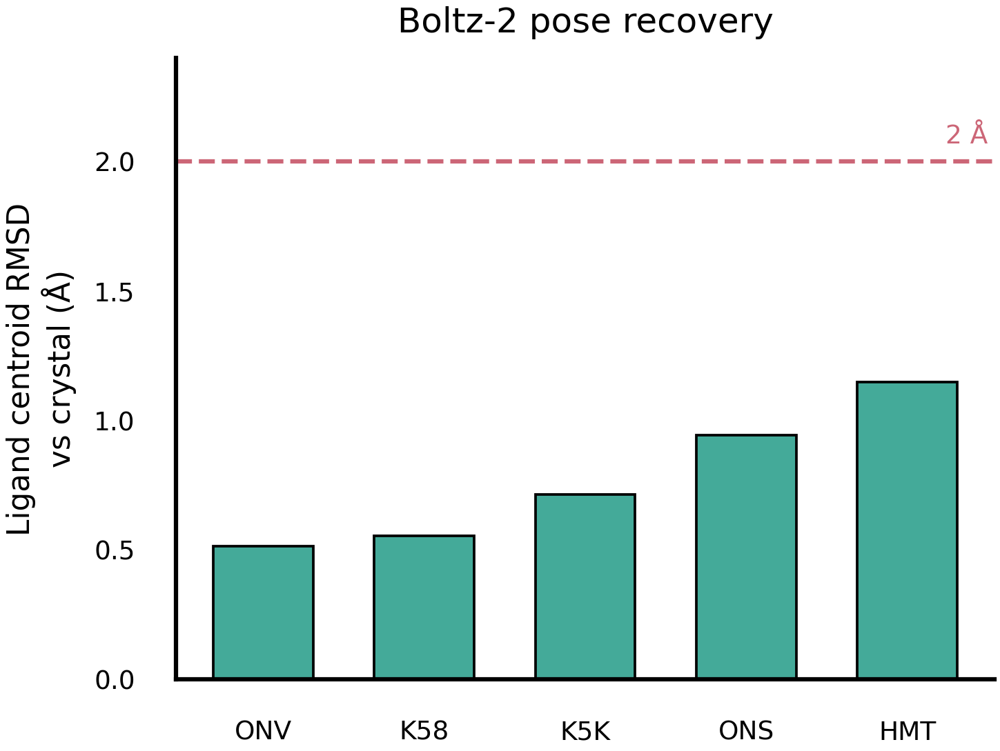
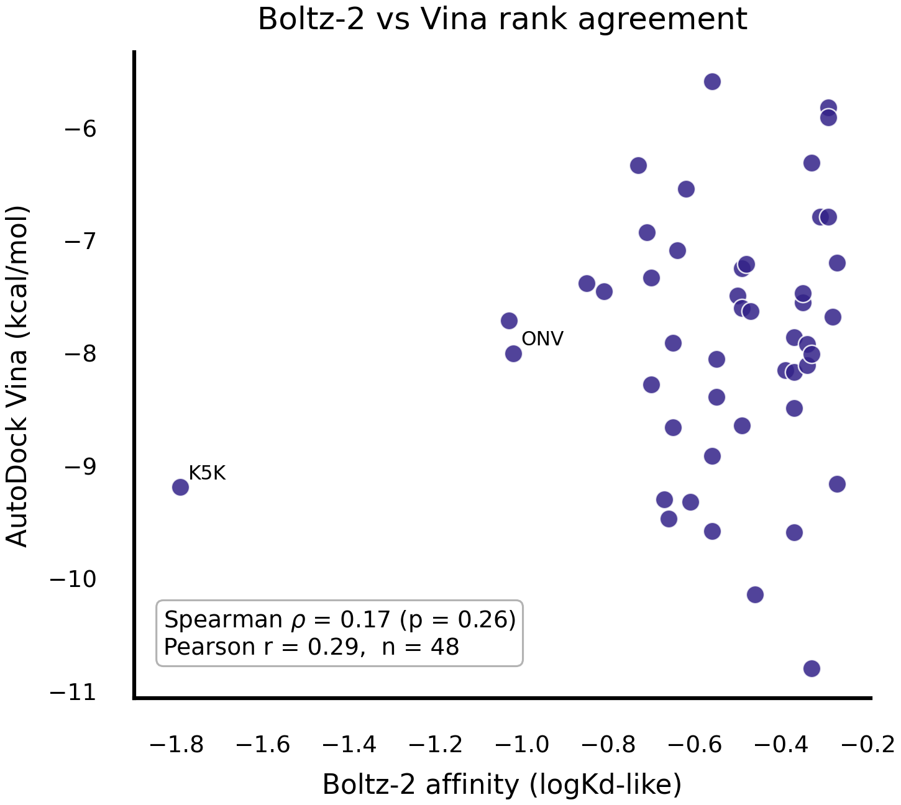

# To Affinity and Beyond: A Structure-Informed Drug Discovery Pipeline for PHGDH Inhibitors Targeting the Alzheimer's-Relevant DNA-Binding Domain

**Leo Joseph¹, Yashwin Madakamutil¹, Cale Seymour¹, Ziheng Wang¹**
¹University of California, San Diego

---

## Abstract

Phosphoglycerate dehydrogenase (PHGDH) was recently shown to moonlight as a transcription factor independent of its enzymatic activity, via a helix-helix-turn-helix (HHTH) subdomain spanning residues 103–165 within its nucleotide-binding domain (Chen et al. 2025 *Cell*). This DNA-binding activity drives expression of IKKα and HMGB1, suppressing autophagy and accelerating amyloid pathology in Alzheimer's disease (AD). Of the published PHGDH inhibitors only NCT-503 has reported in-vivo AD evidence — the rest of the chemical matter is plausibly AD-relevant but untested. We screened four candidate sets — known binders, scaffold-seeded *de novo* designs, ChEMBL drug-like repurposing candidates, and REINVENT4 reinforcement-learning outputs — using Boltz-2 affinity prediction, AutoDock Vina orthogonal rescoring, multi-conformation robustness against four PHGDH backbones, and a six-target off-target counter-screen (four Rossmann-fold dehydrogenases + two GRK kinases). Structural alignment of five inhibitor co-crystals onto a common apo frame shows that the previously-labeled "allosteric" (Pacold 2016) and "NAD-competitive" (Weinstabl 2019) inhibitor classes occupy the same physical pocket within the NADH cofactor footprint, with 30–38 % of each inhibitor's pocket-lining residues falling inside the HHTH-DBD span; every structurally-resolved cofactor-pocket inhibitor contacts the DNA-binding motif, consistent with Chen et al.'s experimental finding that NCT-503 does so. **Compound 15 (PDB ligand K58)** of Weinstabl et al. 2019 emerges as the cleanest selective PHGDH binder (combined selectivity index −4.78), followed by BI-4924 (K5K), NCT-503, and compound 15 (ONS) of Pacold et al. 2016. Critically, de novo generation seeded from each of the three top binders — including compound 15 (K58) itself — produced compounds with strong predicted affinity but failing off-target selectivity, demonstrating that affinity-guided generation does not recover the selectivity of its seed scaffolds. The repurposing candidate compound 15 (K58) remains superior to any compound generated from it; selectivity, not affinity, is the binding constraint for this target.

---

## 1. Introduction

PHGDH (EC 1.1.1.95) is the first committed enzyme of serine biosynthesis, catalyzing the NAD⁺-dependent oxidation of 3-phosphoglycerate to 3-phosphohydroxypyruvate. Its catalytic function has been an oncology drug-discovery target for over a decade, ever since tumor cells with PHGDH amplification were shown to be serine-dependent for growth (Possemato et al. 2011; Locasale et al. 2011). Chen et al. (2025) recently reported a second, *moonlighting* function: PHGDH acts as a transcription factor *independent of its enzymatic activity*, via a helix-helix-turn-helix (HHTH) subdomain spanning residues 103–165 within the nucleotide-binding domain. This subdomain shows structural similarity to the three-amino-acid-loop-extension (TALE) homeodomain family of DNA-binding motifs. In astrocytes, this transcriptional activity drives expression of IKKα and HMGB1 — promoting NF-κB signaling and suppressing autophagy — and accelerates amyloid-β pathology in mouse and human-organoid models of AD. NCT-503, an allosteric PHGDH inhibitor developed for cancer (Pacold et al. 2016), is the experimental anchor for this axis: Chen et al. (2025) showed it interacts with residues both outside and within the HHTH-DBD, reduces PHGDH occupancy at its target promoters, alters the downstream gene program, and rescues amyloid phenotypes in AD models — the only PHGDH inhibitor with published in-vivo AD evidence and direct evidence of moonlighting-function disruption.

Two distinct published inhibitor classes target PHGDH. The **NCT series** of indole-carboxamides (NCT-503, plus compound 1 (ONV) and compound 15 (ONS) of Pacold et al. 2016) were originally described as allosteric. The **Boehringer-Ingelheim series** (BI-4924 (K5K) and compound 15 (K58) of Weinstabl et al. 2019) was described as NAD-competitive. Structural alignment of all four inhibitor co-crystals (PDB 6PLF, 6PLG, 6RJ3, 6RJ6) onto a common apo frame, however, places their ligand centroids within 3.3 Å of each other and 4–6 Å from the NADH centroid in the cofactor pocket of 6CWA; the natural-product binder homoharringtonine (PDB 7EWH, ligand HMT) sits at 2.5 Å from NADH, essentially in the cofactor pose. The 3-phosphoglycerate substrate pocket is 12–18 Å away, clearly distinct. We conclude that all published PHGDH inhibitor scaffolds converge on a single cofactor-binding subsite; the "allosteric" vs "NAD-competitive" labels describe *functional* differences (whether the inhibitor displaces NADH or blocks catalysis) rather than separate binding sites. Moreover, **30–38 % of each inhibitor's pocket-lining residues lie within the Chen 2025 HHTH-DBD span — residues 149–156 of the cofactor pocket sit inside the 103–165 HHTH motif** — direct physical contact between every published PHGDH inhibitor and the DNA-binding motif. This is consistent with the experimental anchor: Chen et al. (2025) report that NCT-503 contacts residues both outside and within the HHTH-DBD and blocks PHGDH–DNA binding — i.e., a cofactor-pocket inhibitor demonstrably disrupts the moonlighting function. Our structural-convergence analysis extends that single experimental observation into a testable prediction: because the BI and Pacold co-crystallized inhibitors occupy the same subsite, they are predicted to share NCT-503's ability to perturb the HHTH conformation required for DNA recognition, regardless of whether NADH binding is involved. NCT-503 itself has no high-resolution co-crystal and is therefore not in our structural alignment; it provides the functional validation, while the four resolved co-crystals provide the structural convergence.

The operational question for AD repurposing is therefore not *"which compound binds PHGDH most tightly?"* but *"which existing PHGDH binders are selective enough to repurpose without confounding off-target effects?"* Standard affinity-only screens cannot answer the selectivity question. We address it by ranking candidates on two axes simultaneously: predicted affinity (Boltz-2 with AutoDock Vina rescore) and off-target selectivity against the most chemically-related proteins — four Rossmann-fold dehydrogenases (which share the NADH-binding fold) and two GRK kinases (representing generic ATP-pocket pharmacophore promiscuity).

We construct candidates from three independent generation engines (scaffold-seeded TamGen, ChEMBL library screening, and REINVENT4 with Boltz-as-reward reinforcement learning), score them with two orthogonal predictors, validate against a four-backbone conformational ensemble and a six-target off-target panel, and rank by a *combined selectivity index*. We report four selectivity-validated repurposing candidates, one surviving novel-scaffold candidate, and a methodological finding that novel scaffolds passing affinity and drug-likeness filters can still fail kinase-pharmacophore selectivity.

---

## 2. Methods

### 2.1 Data sources

The primary target structure is PHGDH chain A from PDB 6CWA (1.85 Å; ternary complex with NADH and 3-phosphoglycerate), comprising residues 6–278 of UniProt O43175 (299 amino acids). The query sequence (`data/phgdh_6CWA_chainA.fasta`) was used to construct a 2407-sequence multiple sequence alignment via the ColabFold MMseqs2 API (Mirdita et al. 2022). Three additional PHGDH backbones — 6CWA stripped to apo, 6CWA with bound 3PG, and 2G76 (1.7 Å, alternative apo) — were prepared for the multi-conformation robustness panel. FPocket druggability scoring (`results/druggability/`) showed that fully stripping the cofactor collapses the 6CWA cleft (apo druggability 0.002 vs 0.20 for the NADH-bound and 0.86 for the BI-4924-bound reference); the 3PG-retained and inhibitor-bound backbones keep a well-formed pocket. Absolute affinities on the bare-apo backbone should therefore be read alongside the multi-conformation panel, which includes the ligand-competent conformations.

The validated reference set comprises ten characterized PHGDH binders. Throughout this paper we refer to each compound by its original publication name, with the PDB chemical-component identifier in parentheses: **NCT-503** (Pacold et al. 2016; no co-crystal); **compound 1** (Pacold et al. 2016; PDB ligand ONV, 6PLF); **compound 15** (Pacold et al. 2016; PDB ligand ONS, 6PLG); **BI-4924** (Weinstabl et al. 2019; PDB ligand K5K, 6RJ6); **compound 15** (Weinstabl et al. 2019; PDB ligand K58, 6RJ3 at 1.42 Å — the highest-resolution PHGDH co-crystal published); **CBR-5884** (Mullarky et al. 2016; covalent at Cys234); **homoharringtonine** (PDB ligand HMT, 7EWH; natural product); plus the endogenous ligands NADH and 3PG. Because two distinct compounds are both "compound 15" in their respective papers, we retain the PDB ligand code — compound 15 (K58) of Weinstabl vs compound 15 (ONS) of Pacold — as a disambiguator throughout. Real co-crystal structures for each are tracked in `data/structures_reference/`. The repurposing screen drew from ChEMBL 34, which we filtered from 2.4 million compounds to 1.0 million Lipinski/PAINS-clean drug-like molecules and then randomly sampled to 5000 lead-like candidates.

### 2.2 Candidate generation engines

Three engines produced complementary candidate sets. **TamGen** (Wu et al. 2024), a pocket-conditional autoregressive SMILES generator with variational pocket conditioning, was run in four scaffold-seeded branches: B1 (NCT-503 seed, allosteric pocket), B2 (BI-4924 seed, NAD-competitive), B3 (PKU drug repurposing; yielded no competitive hits and is not discussed further), and B4 (K58 seed, added after the selectivity analysis to generate from the eventual combined-selectivity winner). Iterative scaffold-seeding rounds brought the TamGen total above 1,000 compounds. **REINVENT4** (Loeffler et al. 2024) was run as a 100-step staged-learning RL job (batch size 64) with Boltz-2 as the inner-loop reward oracle, implemented via a custom `ExternalProcess` plugin that submits a nested SLURM job per RL step. The composite reward is `0.45·σ(−aff) + 0.20·QED + 0.15·σ(6−SA) + 0.10·MW_window + 0.05·logP_window + 0.05·mech_bonus`, with a hard reject (reward = 0) on invalid SMILES, PAINS/Brenk substructure hits (RDKit FilterCatalog), or SA score > 7. The composite design was motivated by an early reward-hacking failure: an affinity-only objective produced compounds with Boltz affinity −1.59 but logP > 7 and PAINS hits.

### 2.3 Scoring and validation

All candidates were scored with **Boltz-2** (Passaro et al. 2025), which jointly predicts protein-ligand complex structure and binding affinity. Boltz was ported to AMD MI300A via ROCm 6.3 with the `--no_kernels` flag (cuequivariance is NVIDIA-only). Per-candidate parallelism was achieved by running four Boltz processes per node pinned to individual APUs via `HIP_VISIBLE_DEVICES`, fanned out across four nodes through SLURM array jobs (16 effective parallel workers). All scoring used Boltz-2 v2.2.1 (commit `cb04aec`). **Pose-recovery validation** on five PHGDH co-crystals (6RJ3, 6RJ6, 6PLF, 6PLG, 7EWH), superposing each predicted complex onto its crystal by chain-A `cealign` and measuring ligand-centroid displacement, recovered the correct subsite to **< 1.2 Å in every case** (Supplementary Figure 2; `scripts/repose_cealign.py`), confirming Boltz-2 localizes ligands to the right pocket. **AutoDock Vina 1.2** (Eberhardt et al. 2021) was used as an independent physics-based rescore on Boltz-predicted poses; receptor and ligand PDBQT preparation used Meeko's `mk_prepare_receptor`/`mk_prepare_ligand` with OpenBabel fallback for tautomer-induced atom-typing failures. Boltz-2 and Vina rankings agree only weakly across the full candidate set (Spearman ρ = 0.17, n = 48; Supplementary Figure 3), converging mainly at the high-affinity extreme, so we treat Vina as an independent filter rather than confirmation of the Boltz-2 ranking.

Two validation passes followed primary scoring. **Multi-conformation robustness** re-scored the top 21 candidates against the four PHGDH backbones; per-ligand standard deviation across the ensemble measures sensitivity to conformational state. The **off-target selectivity panel** scored the top 11 candidates against six structurally related proteins: four Rossmann-fold dehydrogenases (LDH-A UniProt P00338, MDH2 P40926, GAPDH P04406, IDH1 O75874) representing NADH-pocket fold homology, plus two GRK kinases (GRK5 P34947, GRK2 P25098) testing ATP-pocket pharmacophore promiscuity. Off-target sequences were obtained from UniProt; per-target MSAs were built with the same ColabFold pipeline. The kinase panel was motivated by post-hoc analysis of top ChEMBL hits, seven of which originated from unrelated kinase drug-discovery programs. The *combined selectivity index* is the sum of dehydrogenase-panel and kinase-panel `sel_idx` values, where each `sel_idx = PHGDH_aff − min(off-target_aff)`; lower values indicate stronger PHGDH preference. We use the worst-case (`min`) off-target to penalize any single strong cross-reaction, and an unweighted sum to weight the two physically distinct panels (fold-homologous dehydrogenases; ATP-pocket kinases) equally; substituting a `mean`-based index reorders only the lower tiers, not the Tier-1 set. Per-ligand Boltz-2 affinity varies by ≈ 0.2 logKd across the four backbones (median multi-conformation s.d. 0.20, max 0.47), so ranking differences below ≈ 0.2 should be read as ties.

To establish that the validated PHGDH binders share a common pocket, we aligned five inhibitor co-crystals (6PLF, 6PLG, 6RJ3, 6RJ6, 7EWH) and the endogenous-cofactor structure (6CWA) onto our apo target using `cealign` (Shindyalov & Bourne 1998), computed ligand centroids in the apo frame, and constructed an all-pairs distance matrix (Figure 1A inset). All five inhibitor ligand centroids cluster within 3.3 Å of each other and 4–6 Å from NADH; the substrate 3PG is 12–18 Å from any inhibitor. Pocket residues were defined as protein residues with any atom within 5 Å of the bound ligand on the apo backbone (`scripts/check_pocket_overlap.py`); the union of these pocket residues was compared against the Chen 2025 HHTH-DBD span (residues 103–165) to quantify physical overlap between the inhibitor pocket and the DNA-binding motif.

### 2.4 Compute

Pipeline runs were performed on the SDSC Cosmos cluster (AMD MI300A APUs, ROCm 6.3). Total compute footprint ≈ 30 APU-hours, dominated by REINVENT's inner-loop Boltz scoring (6,400 SMILES × ~25 sec/ligand on a single APU). All code, structure inputs, predicted poses, and reference co-crystals are at https://github.com/l1joseph/Alzheimers_Drug_Discovery.

---

## 3. Results

### 3.1 Pipeline architecture and target characterization

We constructed a candidate-generation → scoring → validation pipeline (Figure 1c) on AMD MI300A APUs and applied it to the PHGDH apo monomer (6CWA chain A) annotated with the Chen 2025 HHTH-DBD (Figure 1a). The all-pairs centroid distance matrix among five inhibitor co-crystals shows that the published "allosteric" and "NAD-competitive" PHGDH inhibitor classes converge on a single cofactor-adjacent subsite (max pairwise distance 3.3 Å among compound 1 (ONV), compound 15 (ONS), compound 15 (K58), and BI-4924 (K5K); 4–6 Å from the NADH centroid; homoharringtonine (HMT) at 2.5 Å from NADH; 3PG > 12 Å away). Eight contiguous residues of this pocket (residues 149–156) sit inside the 103–165 HHTH-DBD span, providing a structural rationale for inhibition of the moonlighting function (Figure 1a; `scripts/check_pocket_overlap.py`) — and matching Chen et al.'s experimental finding that NCT-503 contacts residues both inside and outside the HHTH-DBD. Boltz-2 recovered all five reference-ligand poses to < 1.2 Å centroid against their crystals (Supplementary Figure 2), supporting the reliability of this pocket-level analysis.

**Figure 1.** Target biology and pipeline. **(a)** PHGDH apo monomer (6CWA chain A, gray cartoon) with the Chen 2025 HHTH-DBD motif highlighted (residues 103–165, cyan) and the NAD⁺/NADH cofactor (green sticks, from aligned 6CWA) marking the cofactor-adjacent inhibitor pocket; pocket residues 149–156 fall inside the HHTH-DBD span. **(b)** The Chen 2025 moonlighting mechanism: PHGDH's HHTH domain drives IKKα/HMGB1 transcription independent of enzymatic activity, accelerating amyloid pathology. **(c)** Computational pipeline: three generation engines → Boltz-2 + Vina scoring → multi-conformation + six-target off-target validation → combined-selectivity ranking.

### 3.2 Designed compounds and screening yields

The TamGen branches (B1–B4) generated >1,000 compounds with Boltz-2 affinities ranging from −1.82 (compound 15 / ONS reference) to weakly positive. **REINVENT4** with the composite reward executed 100 RL steps × batch 64 = **6,400 scored SMILES**; 747 unique compositions exceeded reward 0.55, with a global maximum of 0.752 at step 59. **ChEMBL 34** drug-like library screening returned **4,882 of 5,000** sampled compounds successfully scored (98 %). Notably, 7 of the 10 top-ranked ChEMBL hits by Boltz affinity were repurposed kinase inhibitors from unrelated discovery programs — an early signal of the nucleotide-pocket pharmacophore promiscuity that the kinase counter-screen later quantified.

### 3.3 Selectivity-validated candidate ranking

Combining Boltz-2 and Vina affinities with the six-target off-target panel (Figure 2, Figure 3) reorders the candidate ranking. By **combined selectivity index** (sum of dehydrogenase- and kinase-panel `sel_idx`), four validated PHGDH inhibitors form a Tier 1 set: **compound 15 (K58)** at combined sel_idx **−4.78**, BI-4924 (−3.55), NCT-503 (−2.72), and compound 15 (ONS) at −2.58. Of these, compound 15 (K58) is uniquely clean across all six off-targets (every off-target Boltz affinity is positive, ranging +1.36 to +1.76), consistent with its industry-grade lead-optimization history (Weinstabl et al. 2019) and its 1.42 Å co-crystal — the highest-resolution PHGDH structure published (PDB 6RJ3). One TamGen-generated novel scaffold (`r2b2_107`, a BI-4924-seeded derivative) survives both selectivity panels at combined sel_idx = −1.28. The kinase counter-screen — motivated by post-hoc analysis of top ChEMBL hits, seven of which originated from unrelated kinase drug-discovery programs — eliminates three of four novel B1 hits that had passed Boltz, Vina, and drug-likeness filters: `b1_058` prefers GRK2 by +0.75 log-Kd, `b1_112` prefers GRK kinases by +0.61, and `b1_005` is borderline non-selective. This failure mode is **invisible to affinity-only screens** and is the central methodological contribution of this work; demonstrated here against two GRK-family kinases (consistent with the ChEMBL provenance), it should be read as GRK-class ATP-pocket promiscuity pending a broader kinase counter-screen.

**Figure 2.** Top-10 candidate metrics. **(a)** Boltz-2 predicted affinity vs PHGDH (more negative = stronger). **(b)** AutoDock Vina orthogonal rescore. **(c)** Drug-likeness heatmap (green = ideal, red = Lipinski/SA boundary). **(d)** Combined selectivity index (lower = more PHGDH-selective; dashed line = Tier-1 cutoff −2.0). Bars colored by source class: validated known binders (indigo), novel NAD-competitive (teal), novel allosteric (rose).

**Figure 3.** Off-target selectivity matrix: 11 ligands × 7 targets (PHGDH + 4 Rossmann-fold dehydrogenases + 2 GRK kinases), sorted by combined selectivity index. Blue = stronger predicted binding. Vertical lines separate the on-target (PHGDH) from the dehydrogenase and kinase panels. Compound 15 (K58, top row) shows no off-target binding; the b1 novel hits (bottom) prefer GRK kinases.

### 3.4 Comparison with established PHGDH binders

The Tier 1 candidates were directly compared against the validated reference set on three axes (Figure 2, Figure 4). On **affinity**, compound 15 (ONS) attains the strongest predicted PHGDH binding (Boltz −1.82, Vina −10.58 kcal/mol), with BI-4924 (−1.79 / −9.19), compound 15 (K58, −1.00 / −8.66), and NCT-503 (−0.30 / −8.14) following; all four sit firmly in the lead-grade range (Vina < −7 kcal/mol). NCT-503's affinity is the least certain of the set — Boltz-2 assigns it a binding probability of only 0.29 (vs 0.81–0.97 for the others) and a threefold-higher predicted interface error — consistent with its ~2.5 µM potency and the absence of a co-crystal to anchor its allosteric pose; its score should be read as "weak binder," not a precise value. On **drug-likeness**, Lipinski-window indices show compound 15 (ONS), BI-4924, and compound 1 (ONV) at the upper Ro5 boundary (MW 499–510, logP 3.1–4.8) while NCT-503 (MW 408) and compound 15 (K58, MW 349) are smaller and more CNS-druggable; the B1 series novel hits cluster at MW 309–469 with PAINS-clean / SA ≤ 4 profiles. On **binding pose** (Figure 4), the compound 15 (K58) 6RJ3 co-crystal and the Boltz-predicted poses of BI-4924, NCT-503, and r2b2_107 all engage the same pocket cleft, positioned to contact residues in the 149–156 HHTH overlap region (predicted-pose contacts are reported at centroid/site resolution; Boltz-2 recovers pocket localization but not atom-level rotamers — Supplementary Figure 2). r2b2_107 reproduces the BI-4924 binding mode despite Tanimoto 0.16 to the parent — a successful scaffold-decoration outcome.

**Figure 4.** Representative candidates compared side by side: compound 15 (K58; validated, 1.42 Å 6RJ3 co-crystal), BI-4924 (K5K; validated), NCT-503 (the AD-anchor compound), and the novel scaffold-seeded design r2b2_107. **(a)** 2D structures. **(b)** Binding pose (gray cartoon, cyan-carbon ligand sticks, wheat pocket residues within 5 Å); the K58 panel is the experimental 6RJ3 co-crystal, the other three are Boltz-2 predictions. Per-compound Boltz-2 affinity, combined selectivity index, MW and SA are annotated beneath each pose. compound 15 (K58) pairs a clean selectivity profile with the highest-resolution co-crystal; NCT-503 binds weakly and with low model confidence (binding probability 0.29); r2b2_107 reproduces the cofactor-pocket engagement at Tanimoto 0.16 to its BI-4924 seed but fails the off-target panel.

### 3.5 De novo design cannot recover the selectivity of its seeds

We seeded scaffold-conditioned TamGen generation from all three top repurposing candidates — NCT-503 (B1, allosteric), BI-4924 (B2, NAD-competitive), and compound 15 (K58; B4, the combined-selectivity winner) — to test whether de novo generation around a validated binder can produce an improved novel-scaffold lead. The compound-15-seeded branch (B4) produced the strongest novel-scaffold affinity in the study: `b4_112` at Boltz −1.02 (prob_binary 0.57), drug-like, Tanimoto 0.19 to BI-4924. However, when the top five B4 hits were put through the same six-target off-target panel, **none reached Tier 1 selectivity**: b4_112 binds GAPDH at −1.47 (stronger than its PHGDH affinity of −1.02), giving a combined selectivity index of only −0.16, and the best B4 hit by selectivity (b4_095) reached only −1.00. This mirrors the B1 collapse exactly: affinity-guided generation maximizes pocket complementarity but is blind to off-target binding, so it cannot reconstruct the selectivity that the parent scaffolds earned through medicinal-chemistry optimization — **regardless of which validated binder is used as the seed**. TamGen scaffold-seeded iteration also showed diminishing returns: a top B2 round-2 hit `r2b2_164` was canonical-SMILES-identical to round-1 `b2_067`. **REINVENT4 RL** with the composite reward + Boltz-as-oracle produced 747 unique drug-like SMILES at reward ≥ 0.55 but did not converge on higher reward over 100 steps (first-/middle-/last-third step-max means 0.66/0.67/0.66; global max 0.752 at step 59); its strongest candidate by multi-conformation rescore (`step_59`) achieved mean affinity only −0.05 across four backbones, the high reward being driven by drug-likeness and novelty components rather than binding. The composite reward did, however, eliminate the reward-hacking failure mode of round-1 b2_067 (no PAINS hits in 6,400 scored SMILES at reward ≥ 0.55).

**Supplementary Figure 1.** REINVENT4 RL trajectory over 100 steps. Per-step maximum (blue) and mean nonzero (gray) composite reward. The agent diversified chemistry but did not converge on higher reward; the global maximum of 0.752 (step 59) was not subsequently exceeded.

**Supplementary Figure 2.** Boltz-2 pose recovery on five PHGDH co-crystals. Ligand-centroid RMSD between each Boltz-2 prediction and its crystal pose after chain-A `cealign` superposition; all five recover to < 1.2 Å (dashed line = 2 Å docking-success threshold). The K5K/BI-4924 case recovers to 0.71 Å; an apparent 31 Å outlier under naïve all-CA, residue-number superposition was an artifact of 6RJ6's partial (99–303) construct (`scripts/repose_cealign.py`).

**Supplementary Figure 3.** Boltz-2 affinity vs AutoDock Vina rescore across all scored candidates (n = 48). The two methods agree only weakly (Spearman ρ = 0.17, p = 0.26), converging mainly at the high-affinity extreme (labelled reference binders); Vina is therefore used as an independent filter, not as confirmation of the Boltz-2 ranking.

## 4. Discussion

The principal finding is that the **combined-selectivity ranking reorders the candidate set in scientifically informative ways**. **Compound 15 (K58) of Weinstabl et al. 2019** emerges as the cleanest selective PHGDH binder — combined sel_idx −4.78, 1.42 Å co-crystal, NAD-competitive mechanism with industry-grade ADME from the Boehringer oncology program — yet was not the candidate Chen et al. (2025) used to demonstrate AD rescue. The relevant context: Chen 2025 used NCT-503 because it had established mouse pharmacokinetics at the time of their experimental design and was the first allosteric PHGDH inhibitor characterized (Pacold et al. 2016). NCT-503's reported catalytic IC50 of ~2.5 μM is approximately 250-fold weaker than the BI compounds (~10 nM); it has no published high-resolution PHGDH co-crystal; and its selectivity profile in our panel shows modest off-target signal against GAPDH and MDH2 (combined sel_idx −2.72 vs −4.78 for compound 15 (K58)). Chen 2025 thus establishes that the moonlighting axis is druggable — not that NCT-503 is the optimal compound for this purpose.

Methodologically, the off-target counter-screen is the single most consequential validation layer in our pipeline. It both refined the Tier 1 ranking (upgrading compound 15 / ONS to Tier 1 after the kinase panel revealed its strong dehydrogenase off-target signal is not mirrored against kinases) and eliminated three of four novel B1 hits that had passed affinity, drug-likeness, and Tanimoto-novelty filters. The B1 collapse demonstrates a **kinase-pharmacophore-promiscuity failure mode** that is well-documented in screening campaigns but is invisible to single-target affinity ranking; given that 7 of 10 top ChEMBL hits in our drug-like library screen were repurposed kinase inhibitors, this failure mode is a generic risk for ML-guided PHGDH inhibitor design and should be incorporated as a standard counter-screen.

A direct test reinforces this point. Seeding TamGen from the selectivity winner compound 15 (K58) (branch B4) produced the project's strongest novel-scaffold affinity (b4_112, Boltz −1.02) but the resulting compounds fail the same off-target panel — b4_112 binds GAPDH more tightly than PHGDH. Across all three de novo seeds (NCT-503, BI-4924, compound 15 (K58)), no generated compound reached Tier 1 selectivity. The validated repurposing candidate compound 15 (K58) thus remains superior to any compound our generative pipeline produced from it: de novo affinity optimization does not recover the off-target selectivity that decades of medicinal chemistry built into the parent scaffold. This is the central practical lesson of the study — for a target whose inhibitor pocket overlaps a conserved cofactor fold, selectivity, not affinity, is the binding constraint, and it is not addressable by affinity-guided generation alone.

Limitations of this study include (i) the absence of experimental affinity measurements; published nM-range IC50s for BI-4924 and compound 15 (K58) establish that Boltz-2 predictions and crystal poses are well-anchored, but multi-seed Boltz averaging would tighten the multi-conformation robustness analysis. (ii) The kinase panel covered GRK kinases motivated by ChEMBL provenance; broader kinase off-targets (LRRK2, JAK1, MK2, MAPK 9/10) were sequence-prepared but excluded due to length constraints in Boltz scoring. (iii) The REINVENT reward ceiling around 0.75 reflects the Boltz affinity ceiling on novel chemistry — scaffold-restricted REINVENT (Mol2Mol or LibInvent on the NCT-503 / compound 15 (K58) cores) is the natural follow-up. Direct experimental validation of compound 15 (K58) in the Chen et al. 2025 PHGDH–DNA-binding assay would be the most informative next step.

## References

1. Chen, J.; et al. Transcriptional Regulation by PHGDH Drives Amyloid Pathology in Alzheimer's Disease. *Cell* **2025**, *188* (13), 3513–3529.e26. DOI: 10.1016/j.cell.2025.03.045.
2. Possemato, R.; et al. Functional Genomics Reveal That the Serine Synthesis Pathway is Essential in Breast Cancer. *Nature* **2011**, *476* (7360), 346–350. DOI: 10.1038/nature10350.
3. Locasale, J. W.; et al. Phosphoglycerate Dehydrogenase Diverts Glycolytic Flux and Contributes to Oncogenesis. *Nat. Genet.* **2011**, *43* (9), 869–874. DOI: 10.1038/ng.890.
4. Pacold, M. E.; et al. A PHGDH Inhibitor Reveals Coordination of Serine Synthesis and One-Carbon Unit Fate. *Nat. Chem. Biol.* **2016**, *12* (6), 452–458. DOI: 10.1038/nchembio.2070.
5. Mullarky, E.; et al. Identification of a Small Molecule Inhibitor of 3-Phosphoglycerate Dehydrogenase to Target Serine Biosynthesis in Cancers. *Proc. Natl. Acad. Sci. U.S.A.* **2016**, *113* (7), 1778–1783. DOI: 10.1073/pnas.1521548113.
6. Weinstabl, H.; Treu, M.; Rinnenthal, J.; Zahn, S. K.; Ettmayer, P.; Bader, G.; Dahmann, G.; Kessler, D.; et al. Intracellular Trapping of the Selective Phosphoglycerate Dehydrogenase (PHGDH) Inhibitor BI-4924 Disrupts Serine Biosynthesis. *J. Med. Chem.* **2019**, *62* (17), 7976–7997. DOI: 10.1021/acs.jmedchem.9b00718.
7. Passaro, S.; Corso, G.; Wohlwend, J.; et al. Boltz-2: Towards Accurate and Efficient Binding Affinity Prediction. *bioRxiv* **2025**. DOI: 10.1101/2025.06.14.659707.
8. Mirdita, M.; et al. ColabFold: Making Protein Folding Accessible to All. *Nat. Methods* **2022**, *19* (6), 679–682. DOI: 10.1038/s41592-022-01488-1.
9. Loeffler, H. H.; et al. Reinvent 4: Modern AI-Driven Generative Molecule Design. *J. Cheminform.* **2024**, *16*, 20. DOI: 10.1186/s13321-024-00812-5.
10. Eberhardt, J.; Santos-Martins, D.; Tillack, A. F.; Forli, S. AutoDock Vina 1.2.0: New Docking Methods, Expanded Force Field, and Python Bindings. *J. Chem. Inf. Model.* **2021**, *61* (8), 3891–3898. DOI: 10.1021/acs.jcim.1c00203.
11. Wu, K.; Xia, Y.; Deng, P.; et al. TamGen: Drug Design with Target-Aware Molecule Generation through a Chemical Language Model. *Nat. Commun.* **2024**, *15*, 9360. DOI: 10.1038/s41467-024-53632-4.
12. Shindyalov, I. N.; Bourne, P. E. Protein Structure Alignment by Incremental Combinatorial Extension (CE). *Protein Eng.* **1998**, *11* (9), 739–747. DOI: 10.1093/protein/11.9.739.
13. Bickerton, G. R.; Paolini, G. V.; Besnard, J.; Muresan, S.; Hopkins, A. L. Quantifying the Chemical Beauty of Drugs. *Nat. Chem.* **2012**, *4* (2), 90–98. DOI: 10.1038/nchem.1243.
14. Ertl, P.; Schuffenhauer, A. Estimation of Synthetic Accessibility Score of Drug-like Molecules. *J. Cheminform.* **2009**, *1*, 8. DOI: 10.1186/1758-2946-1-8.
15. Lipinski, C. A.; Lombardo, F.; Dominy, B. W.; Feeney, P. J. Experimental and Computational Approaches to Estimate Solubility and Permeability in Drug Discovery and Development Settings. *Adv. Drug Deliv. Rev.* **1997**, *23* (1–3), 3–25. DOI: 10.1016/S0169-409X(96)00423-1.

## Author Contributions

**Leo Joseph**: Conceptualization, pipeline architecture, AMD MI300A ROCm porting of Boltz-2 and TamGen, REINVENT4 integration with Boltz-as-reward, ChEMBL library screening, manuscript writing.
**Yashwin Madakamutil**: TamGen scaffold-seeded branch design and iterative-round execution, composite-reward formulation, REINVENT4 SLURM array scoring wrapper, data analysis.
**Cale Seymour**: Off-target selectivity panel design (Rossmann-fold + GRK kinase), AutoDock Vina rescore implementation and Boltz–Vina concordance analysis, multi-conformation Boltz robustness analysis, structural pocket-overlap and pose-recovery validation.
**Ziheng Wang**: PyMOL structural visualization and figure rendering, drug-likeness filter implementation (Lipinski / PAINS / Brenk / SA / QED), Tanimoto-similarity novelty scoring, manuscript review.
All authors: review and editing.
